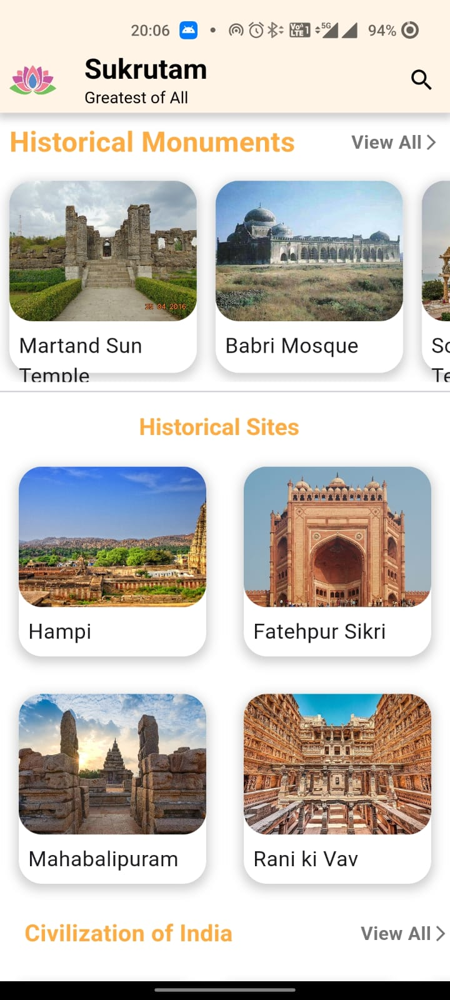
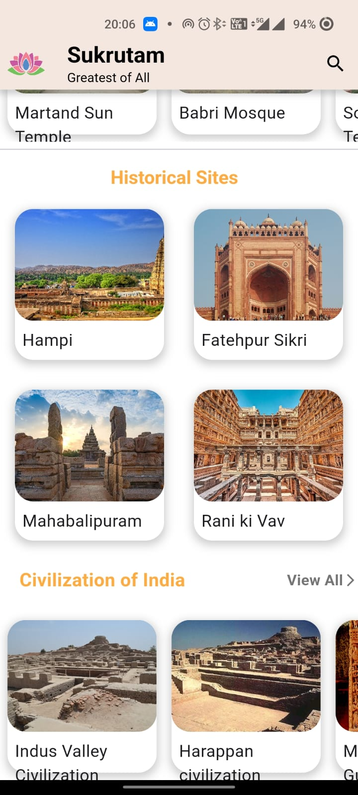
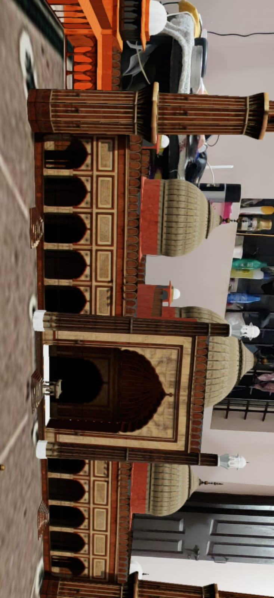
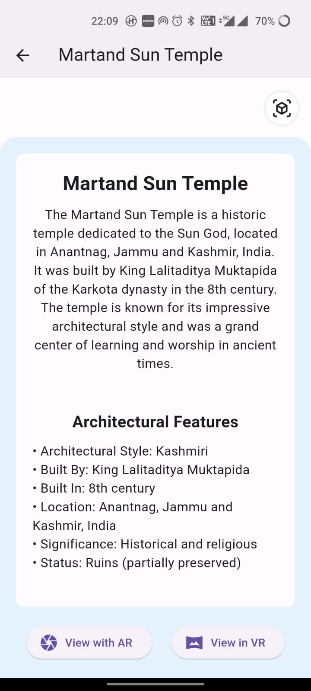

# Flutter VAR Monuments

## Overview

The problem statement highlights the significance of harnessing AR and VR technologies not only to preserve cultural heritage but also to enhance its accessibility and appeal in a rapidly advancing technological landscape. The challenge invites participants to contribute innovative solutions that can have a meaningful impact on our understanding, interaction with, and appreciation of our cultural heritage.

## Screenshots

### Click below to watch Video

[Click here to watch the video](https://youtube.com/shorts/8CiHawyc4zg?feature=share)
| Home Screen | Home Screen |
| :----------------------: | :----------------------: |
|  |  |

|          AR View          |       App Features        |          VR View          |
| :-----------------------: | :-----------------------: | :-----------------------: |
|  |  |  |

## Features

- The approach is to leverage Augmented Reality (AR) and Virtual Reality (VR) technologies to preserve and enhance cultural heritage. This involves creating immersive and interactive experiences that not only showcase historical artifacts and sites but also engage users in a way that promotes understanding, appreciation, and learning.

## Technology Stack

- Flutter 2.5.3
- ARKit (iOS) and ARCore (Android)
- Blender
- Flutter Packages: camera, image_gallery_saver, ar_flutter_plugin,path_provider,model_viewer_plus

## Installation and Setup

- Clone the repository from GitHub: https://github.com/Churanta/Flutter-VAR-Monuments.git
- Open the project in Android Studio or Visual Studio Code
- Install the required packages by running the command flutter pub get
- Connect your mobile device to your computer and enable USB debugging
- Run the app on your mobile device using flutter run

## Code Structure

- 'main.dart' : Endpoint of the app
- 'MainPage.dart' : Home screen with a list of available cars
- 'cars' : AR Screen to view car details

## Contributors

- [Churanta Mondal](https://github.com/Churanta)

## Future Plans

- Add more Models to the list
- Improve AR accuracy and stability
- Add support for more mobile devices
- Implement car customization features

## Future Plans

- Add more Models to the list
- Improve AR accuracy and stability
- Add support for more mobile devices
- Implement car customization features

## License

This project is licensed under the MIT License - see the LICENSE.md file for details..

# Flutter-VAR-Monuments
